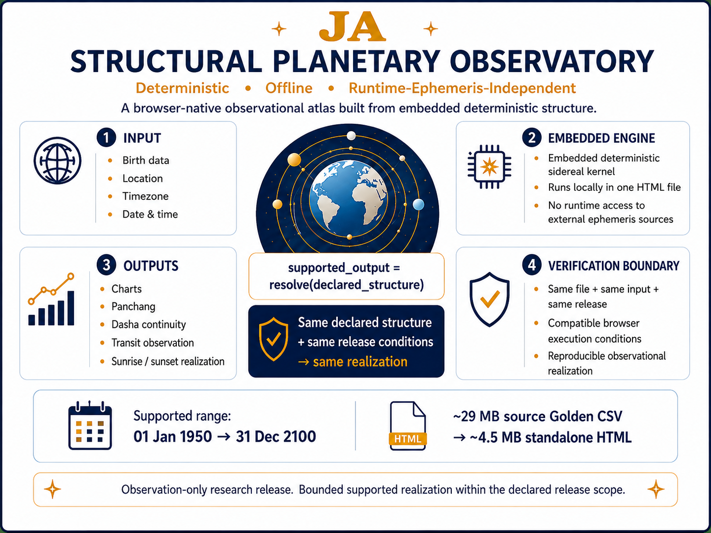

# SSM-JA — Runtime-Ephemeris-Independent Jyotish Atlas


---

## Live browser-native observatory (GitHub Pages)

**Open directly in your preferred language:**

- [English](https://ompshunyaya.github.io/Symbolic-Mathematics-Jyotish-Transit-Kernel/SSM-JA/demo/SSM-JA_v3_7_41.html?lang=en)
- [हिन्दी — Hindi](https://ompshunyaya.github.io/Symbolic-Mathematics-Jyotish-Transit-Kernel/SSM-JA/demo/SSM-JA_v3_7_41.html?lang=hi)
- [ಕನ್ನಡ — Kannada](https://ompshunyaya.github.io/Symbolic-Mathematics-Jyotish-Transit-Kernel/SSM-JA/demo/SSM-JA_v3_7_41.html?lang=kn)
- [മലയാളം — Malayalam](https://ompshunyaya.github.io/Symbolic-Mathematics-Jyotish-Transit-Kernel/SSM-JA/demo/SSM-JA_v3_7_41.html?lang=ml)
- [தமிழ் — Tamil](https://ompshunyaya.github.io/Symbolic-Mathematics-Jyotish-Transit-Kernel/SSM-JA/demo/SSM-JA_v3_7_41.html?lang=ta)
- [తెలుగు — Telugu](https://ompshunyaya.github.io/Symbolic-Mathematics-Jyotish-Transit-Kernel/SSM-JA/demo/SSM-JA_v3_7_41.html?lang=te)

All six links open the same frozen SSM-JA v3.7.41 release directly in the selected presentation language.

---

## What's New in This Release

SSM-JA v3.7.41 is the current frozen standalone release.

Key release characteristics:

- approximately `29 MB` source Golden CSV reduced into an embedded deterministic kernel
- approximately `4.5 MB` standalone HTML release
- no external CSV loading required at runtime
- no runtime external ephemeris API required for core calculation
- no cloud or server-side calculation dependency
- six presentation languages: English, Tamil, Telugu, Kannada, Malayalam, and Hindi
- direct language startup through `?lang=en`, `?lang=ta`, `?lang=te`, `?lang=kn`, `?lang=ml`, and `?lang=hi`
- localized date presentation
- Share State replay and import
- expanded Panchang observation, including selected-date and previous-date Moonrise cycles
- Brief and Detailed print/report workflows
- responsive desktop and mobile presentation
- browser-side embedded-kernel SHA-256 integrity verification

The release remains a single self-contained browser application.

`source Golden CSV -> embedded deterministic kernel -> standalone browser realization`

---

## JA Structural Planetary Observatory Architecture

The browser itself becomes a self-contained deterministic planetary realization engine.

The observatory operates through:

`embedded deterministic structure -> browser-native realization -> reproducible observation`

The diagram below summarizes the architectural direction of JA / SSM-JA as a portable single-file structural planetary observatory.



Core invariant:

`same declared structure + same inputs + same release + compatible browser conditions -> same reproducible realization`

---

## Overview

JA or SSM-JA is a runtime-ephemeris-independent Jyotish observation atlas built as a single-file offline browser application.

It demonstrates that a useful Jyotish observation environment can run locally from embedded deterministic structure, without requiring the following during execution after download:

- internet access
- runtime external ephemeris APIs
- external CSV loading
- cloud services
- database setup
- server installation

The browser itself becomes the deterministic observatory environment.

SSM-JA is released for observation, reproducibility, research, and educational exploration only.

It is not certified astronomical software.

It is not intended for prediction, prescription, critical decision-making, or production deployment.

---

## Brief Release Description

JA is a single-file offline browser-based Jyotish Atlas.

It is designed for calculation, observation, reproducibility, research, and educational exploration.

Browser QA, deterministic regression checks, multilingual verification, embedded-kernel integrity verification, and final release-freeze checks have been completed for v3.7.41.

Release verification is published in the `VERIFY/` folder.

---

## Core Direction

Traditional Jyotish software often depends on runtime ephemeris lookup, external astronomical engines, online services, CSV loading, or software-specific interpolation policies.

SSM-JA explores a different structural direction:

`chart_output = resolve(embedded_kernel_structure)`

The goal is not to replace high-precision ephemeris systems.

The goal is to demonstrate that a bounded observational Jyotish atlas can remain deterministic, portable, and reproducible after removing runtime access to external ephemeris sources during execution.

---

## Challenge

Try to challenge the dependency-authority claim.

The claim is not:

`all ephemerides are unnecessary`

The claim is:

`within a bounded observational range and a fixed release, runtime access to external ephemeris sources is not required for reproducible chart observation`

A valid challenge would demonstrate:

- same input producing inconsistent output within the same release
- offline mode failing due to hidden runtime dependency
- embedded kernel mismatch remaining undetected
- supported-range Dasha timelines showing unbounded drift across tested cases
- deterministic chart structure failing under repeated execution with the same file and same input

If none of these occur, the structural claim becomes more credible within the declared scope.

---

## Relationship to SSM-JTK

SSM-JA is built as an observational atlas layer connected to the SSM-JTK direction.

SSM-JTK establishes the deterministic transit-kernel foundation.

SSM-JA applies that foundation into a browser-based Jyotish observation environment.

Layer separation:

| Layer | Role |
|---|---|
| SSM-JTK | Deterministic transit-kernel foundation |
| SSM-JA | Browser-based Jyotish atlas and observation interface |

This separation is important.

SSM-JTK validates the structural kernel direction.

SSM-JA demonstrates applied observation from embedded deterministic structure.

---

## Integration with SSM-JTK

This release is distributed inside the `SSM-JA/` folder of the parent repository:

**Symbolic-Mathematics-Jyotish-Transit-Kernel (SSM-JTK)**

SSM-JA represents the observational atlas layer built directly on the deterministic SSM-JTK kernel direction.

The broader repository establishes the deterministic transit-kernel foundation.

SSM-JA applies that foundation into a browser-based Jyotish observation environment.

Current public verification follows the same reproducible validation direction established by SSM-JTK.

Published release-verification records include:

- `VERIFY/VERIFY_v3_7_41.md`
- `VERIFY/LANGUAGE_URL_TESTS_v3_7_41.md`

The current verification covers release identity, deterministic runtime behavior, embedded-kernel integrity, multilingual presentation, Share State behavior, responsive layout, print/report paths, Panchang continuity, and final freeze checks.

Additional machine-readable test vectors or independent validator scripts may be added in future releases.

This preserves the broader structural direction:

`offline deterministic structure + fixed release -> reproducible observational realization`

---


## Dependency Elimination Principle

SSM-JA supports the broader Shunyaya Dependency Elimination Framework.

The dependency under examination is:

`runtime access to external ephemeris sources during execution`

The preserved structure is:

`embedded deterministic sidereal kernel`

The observed output is:

`Jyotish chart and timeline observation`

Core structural direction:

`runtime ephemeris access removed during execution -> embedded sidereal structure resolved -> reproducible realization remains`

This is not a claim that astronomical ephemerides are unnecessary.

It is a demonstration that, within a bounded observational range and fixed release, a compact deterministic structure can preserve useful chart resolution without runtime access to external ephemeris sources during execution.

---

## Current Supported Input Range

Supported input range:

`01 Jan 1950` to `31 Dec 2100`

Earlier historical dates remain under extended validation.

Dasha timelines may extend beyond `2100` because they are resolved from the natal Moon structure after the birth chart is computed.

---

## Current Release Contents

The current release follows a compact deterministic release structure.

Release folders:

- `demo/`
- `VERIFY/`
- `assets/`

Current standalone observational release:

`demo/SSM-JA_v3_7_41.html`

The standalone HTML contains:

- embedded deterministic Golden Kernel
- local calculation logic
- Natal, Rasi, and Navamsa realization
- Vimshottari Dasha realization
- Panchang observation
- Transit observation
- global location atlas
- six-language presentation
- Share State replay/import
- Brief and Detailed print/report workflows
- runtime embedded-kernel integrity verification

No additional runtime calculation files are required.

Current verification records:

- `VERIFY/VERIFY_v3_7_41.md`
- `VERIFY/LANGUAGE_URL_TESTS_v3_7_41.md`

Architecture diagram:

- `assets/JA_structural_observatory_architecture.png`

Earlier versioned HTML files may remain in `demo/` as historical artifacts, but v3.7.41 is the current release referenced by this README.

Release principle:

`same file + same inputs + same release conditions -> same deterministic observational realization`

---

## Features

Current release includes:

- Natal chart
- Rasi chart
- Navamsa chart
- Vimshottari Dasha
- Mahadasha
- Antardasha
- Pratyantardasha
- Sookshma Antardasha
- Timestamp-resolved Panchang
- Transit charts
- Planet display ordering by ascending planetary longitude within charts
- Nakshatra mapping
- Nakshatra lord mapping
- Moon Nakshatra and Pada
- Yoga
- Karana
- Paksha
- Sunrise and sunset
- Global tiered location atlas
- Manual location entry
- Offline timezone-aware input
- Runtime SHA-256 kernel integrity check
- Single-file browser execution
- Six-language presentation: English, Tamil, Telugu, Kannada, Malayalam, and Hindi
- Direct language startup through `?lang=`
- Localized full-month date presentation
- Context-sensitive Paksha and Yoga terminology
- Share State replay/import
- Selected-date and previous-date Moonrise-cycle presentation
- Optional local location presets
- Brief and Detailed browser print/PDF workflows
- Responsive desktop and mobile layouts

---

## What SSM-JA Does Not Do

SSM-JA does not provide:

- predictions
- prescriptions
- remedies
- interpretations
- fortune-telling
- critical decision guidance
- certified astronomical accuracy guarantees
- production-grade deployment guarantees
- replacement of professional astronomical software
- replacement of independent Jyotish judgment

It is a calculation and observation system only.

---

## Validation Status

**Current release status: verified and frozen for research/observation release.**

v3.7.41 verification includes:

- JavaScript syntax: `13/13 PASS`
- application views: `11`
- duplicate DOM IDs: `0`
- supported input range: `1950-01-01` through `2100-12-31`
- embedded kernel range: `1900-01-01` through `2100-12-31`
- runtime kernel dates: `73,414`
- embedded kernel bodies: `9`
- deterministic numerical regression: `PASS`
- change-specific multilingual and print closure: `58/58 PASS`
- kernel and Moon-cycle closure: `12/12 PASS`
- six-language presentation: `PASS`
- Share State integrity: `PASS`
- responsive layout closure: `PASS`
- embedded-kernel SHA-256 verification: `PASS`
- final release-freeze audit: `PASS`
- unresolved release-blocking failures: `0`

The release has also undergone manual observational comparison across supported dates and geographically distributed locations, including long-horizon Dasha continuity and sunrise/sunset realization.

Full verification records:

- [SSM-JA v3.7.41 Verification](./VERIFY/VERIFY_v3_7_41.md)
- [Direct Language URL Verification](./VERIFY/LANGUAGE_URL_TESTS_v3_7_41.md)

The current release remains intentionally labeled:

`Research and observation only`

Verification demonstrates deterministic and reproducible behavior within the declared release scope.

It does not constitute formal astronomical certification.

---

## Observational Continuity Example

Controlled observational checks include multi-day continuity comparisons against publicly available values retrieved after the corresponding dates had passed.

Example location: Chicago, Illinois, USA

Example period: `15 May 2026` to `23 May 2026`

Values below were compared against values published on `timeanddate.com`, retrieved on `25 May 2026` for the corresponding past-event dates. These are treated here as post-event published reference values, not as direct physical observations.

---

#### Sunrise Continuity

| Date | JA | timeanddate.com |
|---|---|---|
| 15 May 2026 | 05:30:31 AM | 05:30 AM |
| 16 May 2026 | 05:29:32 AM | 05:29 AM |
| 17 May 2026 | 05:28:35 AM | 05:28 AM |
| 18 May 2026 | 05:27:39 AM | 05:27 AM |
| 19 May 2026 | 05:26:45 AM | 05:26 AM |
| 20 May 2026 | 05:25:53 AM | 05:25 AM |
| 21 May 2026 | 05:25:02 AM | 05:24 AM |
| 22 May 2026 | 05:24:14 AM | 05:24 AM |
| 23 May 2026 | 05:23:27 AM | 05:23 AM |

---

#### Sunset Continuity

| Date | JA | timeanddate.com |
|---|---|---|
| 15 May 2026 | 08:03:39 PM | 08:04 PM |
| 16 May 2026 | 08:04:40 PM | 08:05 PM |
| 17 May 2026 | 08:05:40 PM | 08:06 PM |
| 18 May 2026 | 08:06:39 PM | 08:07 PM |
| 19 May 2026 | 08:07:38 PM | 08:08 PM |
| 20 May 2026 | 08:08:36 PM | 08:08 PM |
| 21 May 2026 | 08:09:33 PM | 08:09 PM |
| 22 May 2026 | 08:10:29 PM | 08:10 PM |
| 23 May 2026 | 08:11:25 PM | 08:11 PM |

These continuity checks evaluate:

- deterministic temporal progression
- local horizon realization stability
- timezone-aware continuity
- bounded observational variation across consecutive astronomical states

The goal is not bit-identical agreement with every published source.

The goal is stable, reproducible, and observationally coherent deterministic realization within the supported range.

---

## Cross-Regional Observational Witness — India (Sunrise & Sunset)

On `28 May 2026`, sunrise and sunset realization were compared against post-event published values collected from **Regional Meteorological Centre (RMC)** live portals after the corresponding sunrise and sunset times had passed across six geographically distributed Indian witnesses:

- New Delhi
- Chennai
- Kolkata
- Mumbai
- Nagpur
- Guwahati

These RMC values are described here as official live-portal published values. They are not described as independently confirmed physical observations unless the relevant RMC or IMD source explicitly states that status.

JA values shown below were generated from the embedded deterministic planetary structure and remained unchanged throughout observation, validation, and repeated realization.

The objective is **not bit-identical agreement**.

The objective is to evaluate whether deterministic offline realization remains observationally coherent across geographically distributed witnesses.

Example date:

`28 May 2026`

### Sunrise

| Location | JA | RMC post-event published |
|---|---|---|
| New Delhi | 05:24:49 AM | 05:25:00 AM |
| Chennai | 05:41:30 AM | 05:42:00 AM |
| Kolkata | 04:52:19 AM | 04:52:00 AM |
| Mumbai | 06:01:08 AM | 06:01:00 AM |
| Nagpur | 05:32:05 AM | 05:32:00 AM |
| Guwahati | 04:31:51 AM | 04:32:00 AM |

### Sunset

| Location | JA | RMC post-event published |
|---|---|---|
| New Delhi | 07:12:06 PM | 07:12:00 PM |
| Chennai | 06:30:48 PM | 06:31:00 PM |
| Kolkata | 06:15:18 PM | 06:15:00 PM |
| Mumbai | 07:10:50 PM | 07:11:00 PM |
| Nagpur | 06:49:44 PM | 06:50:00 PM |
| Guwahati | 06:08:50 PM | 06:09:00 PM |

These comparisons evaluate:

- cross-regional realization stability
- timezone-aware deterministic continuity
- local horizon realization coherence
- portable observational reproducibility

The goal is not perfect agreement with every published source.

The goal is stable, reproducible, and observationally coherent deterministic realization.

**Core invariant remains:**

`same declared structure + same inputs + same release + compatible browser conditions -> same reproducible realization`

---

## Why Manual Verification Matters

SSM-JA is not only tested through single-day planetary output.

A major validation focus is long-horizon Dasha stability.

A representative manual check compares the final Mahadasha boundary across systems.

This is a strong cumulative test because it depends on:

- Moon longitude
- Nakshatra placement
- starting Dasha lord
- birth balance
- Dasha period arithmetic
- date normalization
- long-range timeline accumulation

If a Dasha timeline remains close after approximately `100+` years across tested references, the result provides useful evidence of cumulative structural stability within the tested scope.

---

## **Long-Horizon Dasha Stability**

Long-horizon Dasha validation was tested across:

- DST and non-DST regions
- geographically distributed locations
- historically complex civil-time regions
- multi-decade continuity cases
- high-latitude and future-date stress cases
- neighbouring-region timezone comparison cases

These tests evaluate whether Dasha realization remains observationally stable when civil-time handling becomes difficult.

**Observed structural pattern:**

- explicit UTC offsets preserve deterministic input replay
- civil-time assumptions remain visible instead of hidden
- geographically distributed charts remain observationally stable across tested cases
- timezone ambiguity becomes testable rather than silently absorbed
- long-horizon Dasha realization remained bounded across tested cases

This matters because Dasha realization depends cumulatively on:

- Moon longitude
- Nakshatra placement
- birth balance
- accumulated Dasha arithmetic
- civil-time normalization

Small civil-time differences may accumulate into larger long-horizon Dasha variation.

SSM-JA uses explicit offsets:

`birth input -> declared UTC offset -> explicit UTC moment -> deterministic kernel -> Dasha realization`

**Core observation:**

`same input + same UTC moment + same release -> same realization`

This demonstrates:

- deterministic replay
- civil-time transparency
- timezone-assumption visibility
- observational stability across tested cases

It does **not** imply astronomical correctness guarantees.

---

### Regional Timezone Stability Example — Astana and Tashkent

Additional future-date stress checks were performed across several geographically and timezone-sensitive locations, including high-latitude regions, historically complex civil-time regions, and neighbouring regional comparison cases.

Astana, Kazakhstan and Tashkent, Uzbekistan are used here as one focused example because the comparison helps make timezone-rule assumptions visible.

These cases test whether long-horizon Dasha realization remains stable when the same declared UTC-offset assumption is used.

Using a declared UTC+5 offset for this regional comparison, the following SSM-JA first-cycle Mahadasha end dates were observed:

| Date | Time | Location | JA first-cycle Mahadasha end date |
|---|---:|---|---|
| 21 May 2098 | 02:30 PM | Astana, Kazakhstan | 25 November 2214 |
| 21 May 2098 | 02:30 PM | Tashkent, Uzbekistan | 25 November 2214 |
| 01 January 2050 | 09:30 AM | Astana, Kazakhstan | 15 April 2157 |
| 01 January 2050 | 09:30 AM | Tashkent, Uzbekistan | 15 April 2157 |

This example is useful because long-horizon Dasha boundaries can be sensitive to civil-time interpretation.

In the current research sample, SSM-JA remained internally consistent across this Astana/Tashkent regional comparison when the same declared UTC-offset assumption was used.

The observed pattern is:

`same local input + same declared UTC offset + same release -> same UTC moment -> same Dasha realization`

Systems that depend on hidden timezone databases, projected future rules, or manual DST correction inputs may produce visibly different long-horizon Dasha boundaries when the civil-time assumption changes.

SSM-JA does not claim that timezone complexity disappears.

Its advantage is that the timezone assumption is explicit, replayable, and testable:

`same input + same declared UTC offset + same release -> same realization`

`changed UTC offset -> changed realization`

This supports civil-time transparency and long-horizon Dasha stability research.

---

## Realization Variation

Minor variations may occur across astrology or astronomy systems due to differences in realization pathways including:

- timezone interpretation
- historical DST handling
- future timezone-rule projection
- civil-time normalization
- interpolation policies
- ayanamsa handling
- regional calculation conventions
- calendar boundary handling
- rounding policies
- Dasha transition conventions

A one-hour civil-time difference can become significant in long-horizon Dasha realization because the Dasha sequence is derived from the resolved UTC moment, Moon longitude, Nakshatra placement, and accumulated Dasha arithmetic.

SSM-JA should therefore be evaluated as a deterministic observational atlas rather than as a bit-identical clone of any other software.

The system is designed to make realization assumptions visible.

Its key advantage is not that timezone complexity disappears.

Its key advantage is that timezone assumptions are declared, replayable, and testable:

`same input + same declared UTC offset + same release -> same realization`

`changed UTC offset -> changed realization`

This supports transparency, reproducibility, and realization-layer observability within the supported range.

---

## Timezone and DST Note

The timezone field uses a fixed `+HH:MM` or `-HH:MM` offset.

For DST-observing regions, users should manually verify the correct UTC offset for the selected date.

Example:

- India generally remains `+05:30`
- New York may be `-05:00` or `-04:00`
- London may be `+00:00` or `+01:00`
- Sydney may be `+10:00` or `+11:00`

Incorrect DST offset can shift the chart time by one hour.

Some regions have historically complex timezone transitions.

These may include:

- political renaming
- UTC base offset changes
- evolving DST policies

Because of this, the correct UTC offset may differ across software systems and historical timezone databases.

Controlled testing indicates that even small timezone realization differences can accumulate into noticeable long-horizon Dasha boundary variation.

Because SSM-JA uses an explicit fixed UTC offset, the calculation moment remains transparent and user-verifiable.

This supports deterministic and auditable chart realization within the selected input range.

---

## Runtime Integrity

The embedded kernel includes a frozen SHA-256 identity.

The current release performs a browser-side runtime verification using Web Crypto where available.

Integrity states:

| State | Meaning |
|---|---|
| PASS | Embedded kernel matches frozen identity |
| WARNING | Browser could not verify or digest mismatch occurred |

This converts kernel trust from a documentary statement into executable tamper evidence.

---

The integrity check is performed locally inside the browser using Web Crypto APIs where supported.

No remote verification service is used.

---

## Frozen Release Identity

Current frozen release:

`demo/SSM-JA_v3_7_41.html`

File size:

`4,635,245 bytes`

Whole-file SHA-256:

```text
0fade1279bc389028ba05001e9d6542c5ab0ec40fc51988b06e55f1544451eb1
```

Embedded Golden Kernel SHA-256:

```text
7bdebadfc764ef1f1cc2fc75cd3aaccdc48733f343f3e7311bc4503c354fa351
```

These are different identities:

`whole-file HTML SHA-256 != embedded-kernel SHA-256`

The whole-file SHA-256 identifies the exact frozen HTML release bytes.

The embedded-kernel SHA-256 identifies the deterministic Golden Kernel used by the runtime integrity mechanism.

Verification records:

- [VERIFY_v3_7_41.md](./VERIFY/VERIFY_v3_7_41.md)
- [LANGUAGE_URL_TESTS_v3_7_41.md](./VERIFY/LANGUAGE_URL_TESTS_v3_7_41.md)

Verification principle:

- `same file -> same whole-file hash`
- `different file -> different whole-file hash`

---

## Deterministic Calculation Pipeline

The core calculation pipeline follows this structure:

`birth_input -> embedded_kernel -> longitude_resolution -> rasi -> nakshatra -> navamsa -> dasha -> panchang -> chart_output`

Each stage is deterministic for identical inputs.

Same input should resolve to the same output in the same release.

---

## Deterministic Output Principle

SSM-JA follows a deterministic observational model.

For identical:

- birth inputs
- timezone inputs
- embedded kernel structure
- release version

the system should resolve to the same chart output.

Core invariant:

`same input + same release -> same deterministic chart structure`

This applies specifically to the released embedded kernel version.

---

## Core Formula Direction

Longitude normalization:

`L_norm = L mod 360`

Rasi index:

`RasiIndex = floor(L_norm / 30)`

Nakshatra index:

`NakshatraIndex = floor(L_norm / (360 / 27))`

Pada index:

`PadaIndex = floor((L_norm mod (360 / 27)) / ((360 / 27) / 4))`

Dasha balance:

`RemainingFraction = (NakshatraEnd - MoonLongitude) / NakshatraLength`

These formulas preserve classical scalar output while supporting deterministic structural resolution.

---

## Browser Execution

To run:

1. Download the HTML file.
2. Open it in a modern browser.
3. Enter birth or transit inputs.
4. Generate chart, Dasha, Panchang, or transit output.

No installation is required.

No server is required.

No internet connection is required after download.

---

## Privacy and Local Storage Philosophy

SSM-JA follows a strict offline-first privacy model.

The system does not:

- upload charts
- transmit birth data
- store chart history remotely
- require accounts
- require login
- require cloud synchronization
- maintain server-side profiles
- or depend on online persistence infrastructure

All chart calculations occur locally inside the browser.

No runtime internet connection is required after download.

The current release intentionally avoids persistent chart-save infrastructure.

This is a deliberate architectural decision.

The goal is to preserve:

- privacy
- deterministic offline execution
- dependency minimization
- portability
- low maintenance complexity
- and user-controlled observability

The only optional locally retained information is:

- user-saved location presets

These are stored locally inside the browser for convenience only.

No chart archive, birth database, or remote user profile is maintained by SSM-JA.

This design preserves the principle:

`local observation without centralized personal data dependency`

Users may still preserve outputs independently using:

- browser print
- PDF export
- or local offline archival methods

without requiring the system itself to maintain persistent personal chart infrastructure.

---

## Quick Start

Open the current standalone HTML release in a modern browser:

[Open SSM-JA v3.7.41](./demo/SSM-JA_v3_7_41.html)

No installation, server, internet connection, or runtime access to external ephemeris sources is required for core calculation after download.

For deterministic verification and release identity validation, see:

- [Release Verification](./VERIFY/VERIFY_v3_7_41.md)
- [Language and URL Verification](./VERIFY/LANGUAGE_URL_TESTS_v3_7_41.md)

---

## Verification and Future Validation

Current release verification is published in:

- `VERIFY/VERIFY_v3_7_41.md`
- `VERIFY/LANGUAGE_URL_TESTS_v3_7_41.md`

These records document:

- frozen release identity
- whole-file SHA-256 verification
- embedded-kernel integrity
- deterministic numerical regression
- multilingual presentation
- direct language URL behavior
- Share State behavior
- Panchang continuity
- print/report paths
- responsive layout
- final release-freeze status

Future releases may additionally publish:

- machine-readable frozen test vectors
- independent validator scripts
- expanded observational datasets
- additional regression suites
- externally reproducible acceptance reports

This continues the broader SSM-JTK validation direction while keeping the current standalone release independently inspectable.

---

## Research Boundary

SSM-JA is a research artifact.

It demonstrates a deterministic offline observation system.

It does not make predictive, spiritual, medical, legal, financial, or professional advisory claims.

Users should not make important decisions based on this software.

Independent verification is recommended.

---

## Structural Safety Statement

SSM-JA should be treated as:

`observation before interpretation`

and:

`calculation before judgment`

The system resolves chart structures.

It does not decide meaning.

It does not prescribe action.

It does not replace human responsibility.

---

## Known Limitations

Current limitations include:

- supported input range currently restricted to `01 Jan 1950` through `31 Dec 2100`
- earlier historical dates remain under extended validation
- DST offsets must be verified manually
- output may vary slightly from other ephemeris-dependent systems
- a separate standalone external validator suite is not yet published
- no formal certification
- no production deployment claim
- no prediction or interpretation layer

These limits are deliberate.

They preserve honesty within the current observational release.

---

## Why This Matters

SSM-JA demonstrates that a complex Jyotish observation environment can be delivered as:

`one offline HTML file`

with:

- embedded deterministic kernel structure
- no runtime access to external ephemeris sources during execution
- no cloud dependency
- no CSV loading
- no installation
- no external API
- reproducible local execution

This is a major reference direction for dependency-authority reduction.

The system shows that, at least within a bounded observational range and fixed release, useful chart resolution can remain visible after removing runtime access to external ephemeris sources during execution.

This release also serves as a concrete, runnable reference implementation of a Shunyaya structural pattern within the domain of planetary observation.

---

## Connection to Astronomy

Although SSM-JA is scoped to Jyotish observation, the deeper structural direction extends beyond astrology.

The same architecture may support future astronomical observatory systems:

- offline transit observation
- deterministic sky-state reconstruction
- local celestial event dashboards
- educational astronomy interfaces
- runtime-ephemeris-independent structural visualization

SSM-JA is therefore an applied starting point.

The broader direction is astronomy-aware deterministic observability research.

---

## Relationship to Shunyaya

SSM-JA is part of the Shunyaya ecosystem.

It aligns with a bounded structural pattern:

`supported_output = resolve(declared_structure)`

In this case:

`jyotish_output = resolve(embedded_sidereal_kernel_structure)`

The broader Shunyaya direction explores whether supported outputs, admissibility, and observability can remain reproducible after reducing dependency on assumed runtime authorities.

The central requirement is that the preserved structure remains complete and consistent.

SSM-JA contributes one concrete observational example:

`runtime-ephemeris-independent browser Jyotish atlas`

Master documentation and ecosystem index:

[Shunyaya-Symbolic-Mathematics-Master-Docs](https://github.com/OMPSHUNYAYA/Shunyaya-Symbolic-Mathematics-Master-Docs)

---

## How to Verify This Release

A reviewer may test the frozen release independently:

1. Open `demo/SSM-JA_v3_7_41.html` offline in a compatible modern browser.
2. Confirm the embedded-kernel integrity state shows **PASS**.
3. Enter supported chart data within `1950–2100`.
4. Generate Rasi, Navamsa, Nakshatra, Vimshottari Dasha, Panchang, and Transit output.
5. Repeat the same inputs and confirm deterministic replay.
6. Change presentation language and confirm that numerical realization remains unchanged.
7. Verify the frozen whole-file SHA-256:

```text
0fade1279bc389028ba05001e9d6542c5ab0ec40fc51988b06e55f1544451eb1
```

Windows:

```text
certutil -hashfile demo\SSM-JA_v3_7_41.html SHA256
```

8. Review the published verification records:

   - [VERIFY_v3_7_41.md](./VERIFY/VERIFY_v3_7_41.md)
   - [LANGUAGE_URL_TESTS_v3_7_41.md](./VERIFY/LANGUAGE_URL_TESTS_v3_7_41.md)

9. Optionally compare observational outputs against suitable independent published references for the same date, location, and declared UTC offset.

**Core expected behavior:**

- `same input + same release -> same chart output`
- `same embedded kernel + same release -> same calculation structure`
- `offline browser + compatible execution conditions -> reproducible observation`

---

## 📜 License

See: [LICENSE](./LICENSE)

The SSM-JA reference implementation and verification artifacts are free to use, copy, modify, test, study, and redistribute without a license fee, subject to the terms stated in the LICENSE.

Documentation, architecture materials, specifications, diagrams, and explanatory content are subject to the separate terms stated in the LICENSE, including applicable non-commercial use conditions.

This repository does not claim recognition as a formal technical standard, scientific certification, production qualification, or third-party verification.

---

## Note on Naming

JA is pronounced as:

`Ja` (as in "Jalam")

and not:

`J-A`

---

Shunyaya is an original modern structural and mathematical framework developed by the authors of the Shunyaya Framework.

It is distinct from Shunyata.  

It is not derived from any prior philosophical doctrine, religious system, or traditional terminology.

---

## Final Statement

SSM-JA is a deterministic offline observational atlas.

It is not a prediction engine, certified astronomical software, or a replacement for expert judgment.

It demonstrates that a meaningful Jyotish calculation environment can remain visible from embedded deterministic structure within a bounded observational release.

The system operates without:

- runtime access to external ephemeris sources during execution
- cloud infrastructure
- CSV loading
- installation requirements

`offline deterministic structure + fixed release -> reproducible observational realization`

*Part of the Shunyaya Framework. Built on the SSM-JTK deterministic kernel.*

*Observation and research release only.*

**This is SSM-JA.**
